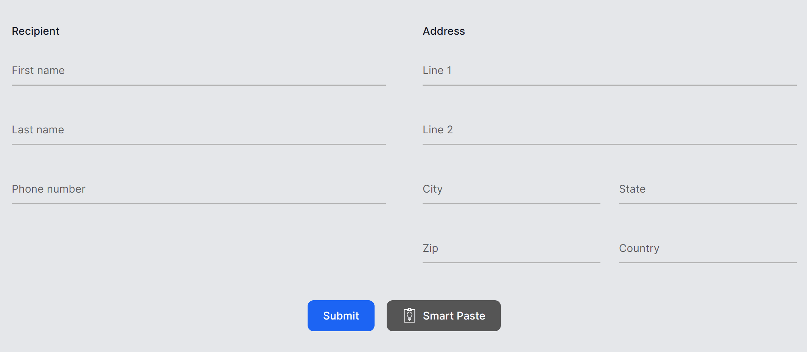
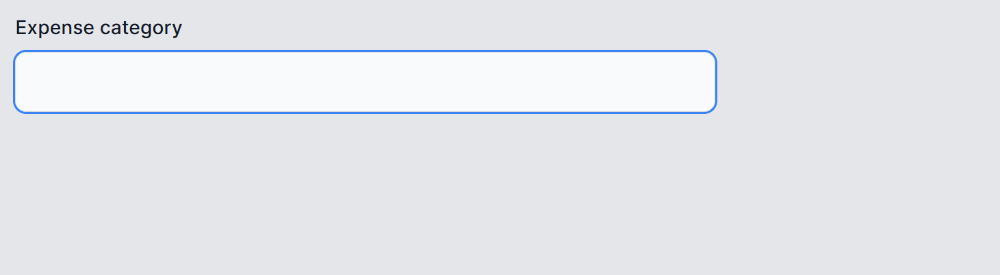
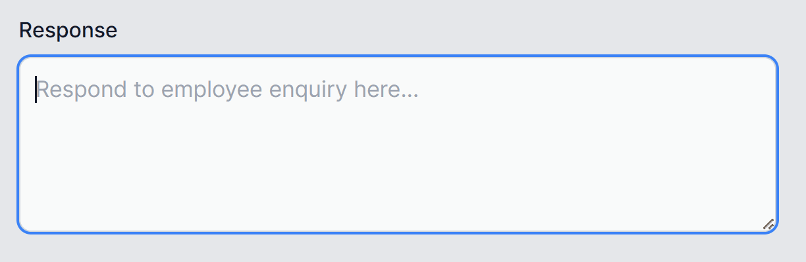

# UI Feature Ideas

| Title | Description |
|-------|-------------|
| [Smart Paste](https://github.com/dotnet-smartcomponents/smartcomponents/blob/main/docs/smart-paste.md) | Smart Paste is an intelligent app feature that fills out forms automatically using data from the user's clipboard. You can use this with any existing form in your web app.  |
| [Smart ComboBox](https://github.com/dotnet-smartcomponents/smartcomponents/blob/main/docs/smart-combobox.md) | A combo box is a UI input element that allows users to type a value and to select a predefined value from an autocompleting dropdown. Traditional combo boxes suggest values only based on exact substring matches. Smart ComboBox upgrades this by suggesting semantic matches (i.e., options with the most closely related meanings). This is much more helpful for users who don't know/remember the exact predefined string they are looking for.  |
| [Smart Text Area](https://github.com/dotnet-smartcomponents/smartcomponents/blob/main/docs/smart-textarea.md) | Smart TextArea is an AI upgrade to the traditional textarea. It provides suggested autocompletions to whole sentences based on its configuration and what the user is currently typing.  |