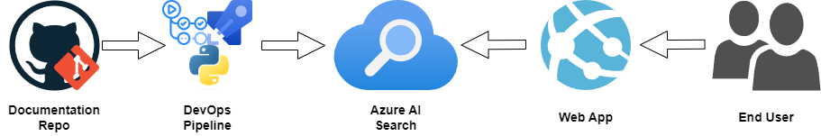
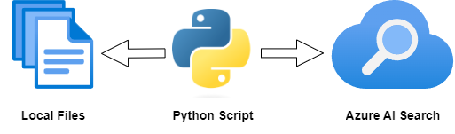

# Chunking markdown files into Azure AI Search
Documentation in software development is a curial part of the software development process. Alot of the time the development documentation is written in markdown files which is what most of my professional documentation is written in but also what this blog and intelligentappfactory.com website. Giving AI/ Vectoring search capabilities to this content can bring a whole new level life to the documentation which can allow the intended audience to find the information they need quicker and easier than ever before.
<!-- more -->
In this post we will:

 - Explore Azure AI search and how it can be used to vector/ semantic search markdown files.
 - Possible uses for indexed markdown files in Azure AI search.
 - How to process markdown files into useable chunks into Azure AI search Index.
 - The python code to process markdown files into chunks and upload to Azure AI search index. 

## The problem
Developers and users of software applications often need to find information quickly and efficiently. This can be difficult when the information is spread across multiple markdown files, each containing a large amount of text. Having an intelligent Assistant that can answer questions and surface relevant information can help users find the information they need. The first part of the solution is to store these files in way that can be easily search and then utilized by an intelligent assistant (AI orchestrator) to present the information to the user. This is where Azure AI search comes in.

## Azure AI Search
Azure AI Search is a cloud-based search-as-a-service solution that gives developers the ability to build powerful search capabilities into their applications. It provides a range of features, including full-text search, faceted navigation, and custom ranking. Azure AI Search also supports semantic search, which uses machine learning to understand the intent behind a user's query and deliver more relevant results. For this post will are going to focus on the vector store and vector/hybrid search capabilities of Azure AI search:

- **Index**: A collection of searchable documents that are organized into fields. Each field contains a specific piece of information about the document, such as its title, author, content, or vector embedding.
- **Document**: A single item in the index that represents a piece of content, such as a markdown file test or part of time. Each document is made up of a set of fields that contain information about the content.
- **Indexer**: A process that reads data from a data source, such as a database or file system, and creates documents in an index based on that data. Indexers can be scheduled to run at regular intervals to keep the index up to date with the data source.
- **Query**: A request for information from the index. Queries can be simple keyword searches or more complex queries that use filters, facets, and other search features.
- **Vector Search**: A search technique that uses vector embeddings to find similar documents based on their semantic meaning. Vector search can be used to find documents that are similar to a given query document or to find documents that are similar to each other.
- **Hybrid Search**: A search technique that combines keyword search with vector search to deliver more relevant results. Hybrid search can be used to find documents that match a user's query while also taking into account the semantic meaning of the query.
- **Semantic Ranking**: A ranking technique that uses machine learning to understand the intent behind a user's query and deliver more relevant results. Semantic ranking can be used to boost the relevance of documents that are similar to the user's query or to demote documents that are not relevant to the user's query.

## Solution Architecture
The ideal solution architecture for this project is shown in the diagram below:

1. The markdown files are stored in an Git repository where developers commit their documentation to main branch.
2. An Github Actions or Azure Pipeline will be triggered which will run a python script used to process the files in useable chunks and upload them to an Azure AI Search index.
3. Azure AI Search will turn the content of each chunk into an vector embedding using Azure OpenAI's text-embedding-ada-002 or text-embedding-ada-003-large model.
4. The Azure AI Search index is then used to power a search interface that allows users to find information in the markdown files. The search interface can be integrated into an intelligent assistant or other application to provide users with quick and easy access to the information they need. Allowing application to perform RAG (Retrieval Augmented Generation) on the indexed markdown files which could be used to provide a chat interface to the documentation.



For this post we will be focusing on using python to process the markdown files into chunks and upload them to an Azure AI Search index locally which at a later date can be integrated into a CI/CD pipeline of the described architecture.


### Why manually index markdown files?
The reason for manually indexing the markdown files is to allow for more control over the indexing process. This can be useful when you want to index only certain parts of the markdown files, such as code snippets or headings, or when you want to apply custom processing to the content before indexing it. 

Manually indexing the markdown files also allows you to experiment with different indexing strategies and see how they affect the search results. When trying using indexer with integrated vectorization or chunking the markdown files into the index, the results can be less than optimal are the solution required more control over the indexing process with the chunking of the markdown files via their headings and subheadings but also increased information in metadata and searchable/ filterable fields in the index.

### Python Script features
The python script will have the following features:

- **Chunking**: The python script will chunk the markdown files into smaller pieces based on the headings and subheadings in the files (up to 3 levels of headings). This will allow the content to be indexed more granularly and make it easier to find specific information in the files.
- **Metadata**: The python script will extract metadata from the markdown files, such as the title, author, and date, and store it in the Azure AI Search index. This will allow users to filter and sort the search results based on this information.
- **Vectorization**: The python script will use Azure OpenAI's text-embedding-ada-002 or text-embedding-ada-003-large model to generate vector embeddings for the content of the markdown files.
- **Indexing**: The python script will upload the content, metadata, and vector embeddings to an Azure AI Search index.
- **Run many times**: The python script can be run multiple times to update the index with new content or changes to existing content. This will keep the index up to date with the markdown files in the repository. Deleting the content which does not need updating is not supported in this version of the script.

### Fields in the Azure AI Search Index
The fields in the Azure AI Search index will be used to store information about the content of the markdown files. The fields will include the following:

- **id**: A unique identifier for the document.
- **title**: The title of the document.
- **content**: The content of the document.
- **metadata**: Additional information about the document e.g. heading information.
- **uri**: The URI of the document. e.g. GitHub URL or hosted page URL.
- **repository**: The repository where the document is stored.
- **path**: The path to the document in the repository.
- **source**: The source of the document.
- **updated**: The date the document was last updated.
- **chunk_number**: The number of the chunk in the document.

## Python Script
The python script will be used to process the markdown files and upload them to an Azure AI Search index. 


The script will be run locally and will require the following dependencies to be installed:
 - azure-search-documents
 - azure-identity
 - langchain_community
 - langchain_openai
 - langchain_text_splitters
 - python-dotenv
 - python-frontmatter
 - markdown

!!! note
    The full code for the python script can be found in the [Intelligent App Factory Solutions repository](https://github.com/LoganDavidTalbot/IntelligentAppFactory-Solutions/tree/main/blogs-solutions/markdown-ai-search)

### Environment variables & cli arguments
The python script will require the following environment variables to be set:
``` bash title=".env" linenums="1"
#Azure Open AI
AZURE_OPENAI_ENDPOINT="https://{{instancename}}.openai.azure.com/" # Azure Open AI Endpoint
AZURE_OPENAI_API_KEY="Azure Open AI Key" # Azure Open AI Key
AZURE_OPENAI_API_VERSION="2023-05-15" # Azure Open AI API Version
AZURE_DEPLOYMENT="text-embedding-ada-002" # Azure Deployment name for ADA Model could be text-embedding-ada-002 or text-embedding-ada-003-large

# Azure Search
VECTOR_STORE_ADDRESS="https://{{instancename}}.search.windows.net" # Azure AI Search Endpoint
VECTOR_STORE_PASSWORD="Azure Search Key" #Azure AI Search Key
INDEX_NAME="index-name" # Azure AI Search Index Name
```
Cli arguments for the python script:
``` bash
python __main__.py --repository org/repo --directory docs
```

### Solution files
The python script will be split into the following files:

- `__main__.py`: The main entry point for the script.
- `importer.py`: A module that contains the main orchestrator that controllers the full process to call all other modules.
- `markdown_parser.py`: A module that contains functions for parsing and chunks markdown files as well as retrieving metadata.
- `vector_search.py`: A module that contains functions for uploading chunked markdown file and its metadata to the Azure AI Search index.
- `document_manager.py`: A module that contains functions for managing the documents in the index including delete.

### Code Snippets

``` python title="__main__.py" linenums="1"
import sys
import argparse
from dotenv import load_dotenv, dotenv_values
import logging
from document_importer.importer import Importer


def main(args: list = sys.argv) -> None:
    logging.info("Starting the document importer...")
    logging.info("-----------------Starting Script-----------------")
    # Parse the arguments
    parser = argparse.ArgumentParser()
    parser.add_argument('-r', '--repository', help='The github repository name', required=True)
    parser.add_argument('-d', '--directory', help='The directory of the markdown documents', required=True)
    parser.add_argument('-l', '--loglevel', default='warning',
                        help='Provide logging level. Example --loglevel debug, default=warning')
    args = parser.parse_known_args(args)

    logging.basicConfig(level=args[0].loglevel.upper(), format="%(asctime)s - %(name)s - %(levelname)s - %(message)s")
    # Load the environment variables
    load_dotenv(override=True)
    config = {
        **dotenv_values(),
    }
    print(f"Imported configuration of length: {len(config.keys())}")
    print(f"Args: {args}")
    Importer(config, repository=args[0].repository, directory=args[0].directory).run()

    logging.info("-----------------Script Completed-----------------")


if __name__ == "__main__":
    main()


```

``` python title="importer.py" linenums="1"
import os
import logging
from document_importer.vector_search import VectorSearch
from document_importer.markdown_parser import MarkdownParser
from document_importer.document_manager import DocumentManager


class Importer:
    def __init__(self, config: dict, repository: str, directory: str) -> None:
        """
        Initializes an instance of the Importer class.
        Args:
            config (dict): The configuration dictionary.
            repository (str): The repository name.
            directory (str): The directory path.
        """
        # Load the environment variables
        self.config: dict = config
        # Verify the environment variables
        self.__check_environment_variable("AZURE_OPENAI_ENDPOINT")
        self.__check_environment_variable("AZURE_OPENAI_API_KEY")
        self.__check_environment_variable("AZURE_OPENAI_API_VERSION")
        self.__check_environment_variable("AZURE_DEPLOYMENT")
        self.__check_environment_variable("VECTOR_STORE_ADDRESS")
        self.__check_environment_variable("VECTOR_STORE_PASSWORD")
        self.__check_environment_variable("INDEX_NAME")
        # Set the parameters
        self.vector_search = VectorSearch(config)
        self.document_manager = DocumentManager(config)
        self.markdown_parser = MarkdownParser()
        self.directory: str = directory
        self.repository: str = repository
        self.chunk_size: int = 1000
        self.chunk_overlap: int = 0
        self.failed_files: list[str] = []
        self.succeed_files: list[str] = []
        self.total_chunks: int = 0
        self.succeed_cleaning: int = 0
        self.file_paths: list[str] = []

    def run(self) -> None:
        """
        Runs the import process.
        """
        # Get all the markdown files
        logging.info("-----------------Getting Markdown Files-----------------")
        self.file_paths = list(self.__get_all_files(self.directory))
        logging.info(f"Found {len(self.file_paths)} markdown files in directory {self.directory}...")
        logging.info(f"Files: {self.file_paths}")
        logging.info("-----------------Getting Pre-import Statistics-----------------")
        self.pre_import_index_stats = self.document_manager.get_document_store_statistics()
        logging.info("-----------------Starting Importing Files-----------------")
        for file_path in self.file_paths:
            try:
                logging.info(f"Loading document {self.repository}:{file_path}...")
                docs = self.markdown_parser.parse(file_path, repository=self.repository,
                                                  chunk_size=self.chunk_size, chunk_overlap=self.chunk_overlap)
                page_contents = docs.get("page_contents")
                page_metadatas = docs.get("page_metadatas")
                if self.document_manager.clean_document(self.repository, file_path):
                    self.succeed_cleaning += 1
                self.vector_search.load_chunks(page_contents, page_metadatas)
                self.succeed_files.append(file_path)
                self.total_chunks += len(page_contents)
            except Exception as e:
                logging.error(f"Failed to load document {file_path}: {str(e)}")
                self.failed_files.append(file_path)
        logging.info("-----------------Importing files completed-----------------")
        logging.info("-----------------Getting Post-import Statistics-----------------")
        self.post_import_index_stats = self.__report_result(self.pre_import_index_stats)

    def __report_result(self, pre_import_index_stats):
        """
        Reports the import result.
        Args:
            pre_import_index_stats: The pre-import index statistics.
        """
        if len(self.failed_files) > 0:
            print(f"Failed to load {len(self.failed_files)}/{len(self.file_paths)}")
            logging.debug(f"Failed files load a total of {self.failed_files} markdown files.")
        if len(self.succeed_files) > 0:
            print(f"Succeed to load {len(self.succeed_files)}/{len(self.file_paths)} markdown files "
                  + f"with a total of {self.total_chunks} chunks "
                  + f"and successful cleaned up {self.succeed_cleaning} older markdown files (if present).")
            logging.debug(f"Succeed files: {self.succeed_files}")
        self.document_manager.get_document_store_statistics(pre_import_index_stats)

    def __check_environment_variable(self, environment_variable: str) -> None:
        if not self.config.get(environment_variable):
            raise ValueError(f"Required environment variable {environment_variable} is not set")

    def __get_all_files(self, directory):
        for dirpath, dirnames, filenames in os.walk(directory):
            for filename in filenames:
                if os.path.splitext(filename)[1] == '.md':
                    yield os.path.join(dirpath, filename)

```


``` python title="markdown_parser.py" linenums="1"
import frontmatter
from langchain_text_splitters import RecursiveCharacterTextSplitter, MarkdownHeaderTextSplitter
from datetime import datetime
from frontmatter import Post


class MarkdownParser:
    def __init__(self):
        pass

    def parse(self, path: str, encoding: str = "utf-8",
              chunk_size: int = 1000, chunk_overlap: int = 0, repository: str = "") -> dict:
        # Load the documents
        markdown_document = self.__load_markdown_document(path)

        # MD splits
        splits = self.__spilt_markdown_document(chunk_size, chunk_overlap, markdown_document)

        return self.__format_chunks(splits, metadata=markdown_document, repository=repository, path=path)

    def __spilt_markdown_document(self, chunk_size, chunk_overlap, markdown_document) -> list:
        headers_to_split_on = [
            ("#", "Header 1"),
            ("##", "Header 2"),
            ("###", "Header 3"),
        ]
        markdown_splitter = MarkdownHeaderTextSplitter(
            headers_to_split_on=headers_to_split_on, strip_headers=False
        )
        md_header_splits = markdown_splitter.split_text(markdown_document.content)

        # Recursive character text splitter
        text_splitter = RecursiveCharacterTextSplitter(
            chunk_size=chunk_size, chunk_overlap=chunk_overlap
        )

        # Split
        splits = text_splitter.split_documents(md_header_splits)
        return splits

    def __load_markdown_document(self, path: str) -> Post:
        markdown_document = frontmatter.load(path)
        if len(markdown_document.keys()) == 0:
            raise ValueError(f"No frontmatter found in the markdown document at {path}...")
        if not markdown_document.get("title") or markdown_document.get("title").strip() == "":
            raise ValueError(f"No title found in the frontmatter of the markdown document at {path}...")
        if not markdown_document.get("summary") or markdown_document.get("summary").strip() == "":
            raise ValueError(f"No summary found in the frontmatter of the markdown document at {path}...")
        if not markdown_document.get("uri") or markdown_document.get("uri").strip() == "":
            raise ValueError(f"No uri found in the frontmatter of the markdown document at {path}...")
        if markdown_document.get("authors") is None or markdown_document.get("authors") == []:
            raise ValueError(f"No authors found in the frontmatter of the markdown document at {path}...")
        return markdown_document

    def __format_chunks(self, chunks, metadata, repository: str, path: str) -> dict:
        page_metadatas = []
        page_contents = []
        today = datetime.utcnow().strftime("%Y-%m-%dT%H:%M:%S-00:00")
        chunk_number: int = 0
        for chunk in chunks:
            chunk_number += 1
            page_metadatas.append({
                    "title": metadata.get("title"),
                    "source": path,
                    "uri": metadata.get("uri"),
                    "repository": repository,
                    "path": path,
                    "summary": metadata.get("summary"),
                    "authors": metadata.get("authors"),
                    "last_update": today,
                    "heading": chunk.metadata,
                    "chunk_number": chunk_number,
                }
            )
            page_contents.append(chunk.page_content)

        return {
            "page_metadatas": page_metadatas,
            "page_contents": page_contents,
        }
```

``` python title="vector_search.py" linenums="1"
from langchain_community.vectorstores.azuresearch import AzureSearch
from langchain_openai import AzureOpenAIEmbeddings
from langchain_community.document_loaders import TextLoader
from langchain_text_splitters import CharacterTextSplitter
from azure.search.documents.indexes.models import (SearchableField,SearchField,SearchFieldDataType,SimpleField,)
import logging


class VectorSearch:
    """
    A class for performing vector-based search using Azure OpenAI and Azure Search.
    """

    def __init__(self, config: dict = {}):
        # Azure OpenAI
        azure_endpoint: str = config.get("AZURE_OPENAI_ENDPOINT")
        azure_openai_api_key: str = config.get("AZURE_OPENAI_API_KEY")
        azure_openai_api_version: str = config.get("AZURE_OPENAI_API_VERSION")
        azure_deployment: str = config.get("AZURE_DEPLOYMENT")

        # Azure Search
        vector_store_address: str = config.get("VECTOR_STORE_ADDRESS")
        vector_store_password: str = config.get("VECTOR_STORE_PASSWORD")
        index_name: str = config.get("INDEX_NAME")

        # Initialize the Azure OpenAI Embeddings
        self.embeddings: AzureOpenAIEmbeddings = AzureOpenAIEmbeddings(
            azure_deployment=azure_deployment,
            openai_api_version=azure_openai_api_version,
            azure_endpoint=azure_endpoint,
            api_key=azure_openai_api_key,
        )
        logging.info(f"Embeddings initialized : {azure_deployment} (endpoint), {azure_deployment} (deployment)")

        # Initialize the Azure Search Vector Store
        self.vector_store: AzureSearch = AzureSearch(
            azure_search_endpoint=vector_store_address,
            azure_search_key=vector_store_password,
            index_name=index_name,
            embedding_function=self.embeddings.embed_query,
            fields=self.__index_fields()
        )
        logging.info(f"Vector store initialized: {vector_store_address} (endpoint), {index_name} (index)")

    def search(self, query: str, k: int = 3, search_type: str = "similarity", filters: str = None):
        return self.vector_store.similarity_search(query=query, k=k, search_type=search_type, filters=filters)

    def load_documents(self, path: str, encoding: str = "utf-8", chunk_size: int = 1000, chunk_overlap: int = 0):
        print("Loading documents: {path}")
        loader = TextLoader(path, encoding=encoding)

        documents = loader.load()
        text_splitter = CharacterTextSplitter(chunk_size=chunk_size, chunk_overlap=chunk_overlap)
        docs = text_splitter.split_documents(documents)

        self.vector_store.add_documents(documents=docs)

    def load_chunks(self, page_contents: list, page_metadatas: list):
        self.vector_store.add_texts(page_contents, page_metadatas)

    def __index_fields(self):        
        fields = [
            SimpleField(
                name="id",
                type=SearchFieldDataType.String,
                key=True,
                filterable=True,
            ),
            SearchableField(
                name="content",
                type=SearchFieldDataType.String,
                searchable=True,
            ),
            SearchField(
                name="content_vector",
                type=SearchFieldDataType.Collection(SearchFieldDataType.Single),
                searchable=True,
                vector_search_dimensions=len(self.embeddings.embed_query("Text")),
                vector_search_profile_name="myHnswProfile",
            ),
            SearchableField(
                name="metadata",
                type=SearchFieldDataType.String,
                searchable=True,
            ),
            # Additional field to store the title
            SearchableField(
                name="title",
                type=SearchFieldDataType.String,
                searchable=True,
            ),
            # Additional field for filtering on document source
            SimpleField(
                name="source",
                type=SearchFieldDataType.String,
                filterable=True,
            ),
            # Additional data field for last doc update
            SimpleField(
                name="last_update",
                type=SearchFieldDataType.DateTimeOffset,
                searchable=True,
                filterable=True,
            ),
            # Additional data field for last doc update
            SimpleField(
                name="uri",
                type=SearchFieldDataType.String,
                searchable=True,
                filterable=True,
            ),
            SimpleField(
                name="repository",
                type=SearchFieldDataType.String,
                searchable=True,
                filterable=True,
            ),
            SimpleField(
                name="summary",
                type=SearchFieldDataType.String,
                searchable=True,
            ),
        ]
        return fields

```

``` python title="document_manager.py" linenums="1"
from ast import Dict, List
from azure.core.credentials import AzureKeyCredential
from azure.search.documents import SearchClient, SearchItemPaged
from azure.search.documents.indexes import SearchIndexClient
import logging


class DocumentManager:
    def __init__(self, config):
        self.service_endpoint = config.get("VECTOR_STORE_ADDRESS")
        self.index_name = config.get("INDEX_NAME")
        key = config.get("VECTOR_STORE_PASSWORD")
        credential = AzureKeyCredential(key)
        self.search_client = SearchClient(self.service_endpoint, self.index_name, credential)
        self.index_client = SearchIndexClient(self.service_endpoint, credential)

    def get_full_document(self, repository: str, source: str) -> SearchItemPaged[Dict]:
        filter = f"repository eq '{repository}' and source eq '{source}'"
        return self.search_client.search(search_text="*", filter=filter, top=1000)

    def clean_document(self, repository: str, source: str) -> int:
        logging.info(f"Cleaning documents for {repository}:{source}...")
        # Getting documents from index
        chunks = self.get_full_document(repository, source)
        data_list: List[Dict] = []
        [data_list.append(chunk) for chunk in chunks]
        if len(data_list) == 0:
            logging.info(f"No documents found for {repository}: {source}")
            return True
        # Deleting documents from index
        results = self.search_client.delete_documents(data_list)
        return self.__report_clean(repository, source, data_list, results)

    def get_document_store_statistics(self, oldStats: Dict = None) -> Dict:
        logging.info(f"Getting statistics for index {self.index_name}...")
        result: Dict = self.index_client.get_index_statistics(self.index_name)
        log: str = f"Statistics for index {self.index_name} retrieved: {result}"
        if oldStats is not None:
            log += f" old stats: {oldStats}"
        print(log)
        return result

    def __report_clean(self, repository, source, data_list, results):
        failed_to_delete: int = 0
        succeeded_to_delete: int = 0
        for result in results:
            if result.succeeded is False:
                failed_to_delete += 1
            else:
                succeeded_to_delete += 1
        if failed_to_delete > 0:
            logging.warning(f"Failed to delete {failed_to_delete}/{len(data_list)} for {repository}:{source}")
        logging.info(f"Succeeded to delete {succeeded_to_delete}/{len(data_list)} in {repository}:{source}")
        return failed_to_delete == 0

    def delete_vector_index(self, index: str):
        self.index_client.delete_index(index)
```

## Conclusion
In this post, we have explored how to chunk markdown files into smaller pieces and upload them to an Azure AI Search index using a python script. We have also discussed the benefits of manually indexing markdown files and the features of the python script. This post is part of a series of posts on how to enable RAG (Retrieval Augmented Generation) on data sources to enable intelligent assistants to provide a chat interface to the documentation. The next post will cover how to use the Azure AI Search index to power an intelligent assistant that can answer questions and provide information from the indexed markdown files. 

!!! note
    The full code for the python script can be found in the [Intelligent App Factory Solutions repository](https://github.com/LoganDavidTalbot/IntelligentAppFactory-Solutions/tree/main/blogs-solutions/markdown-ai-search)