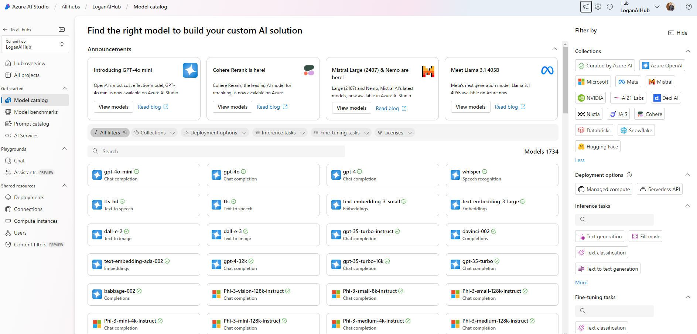
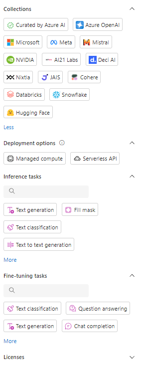
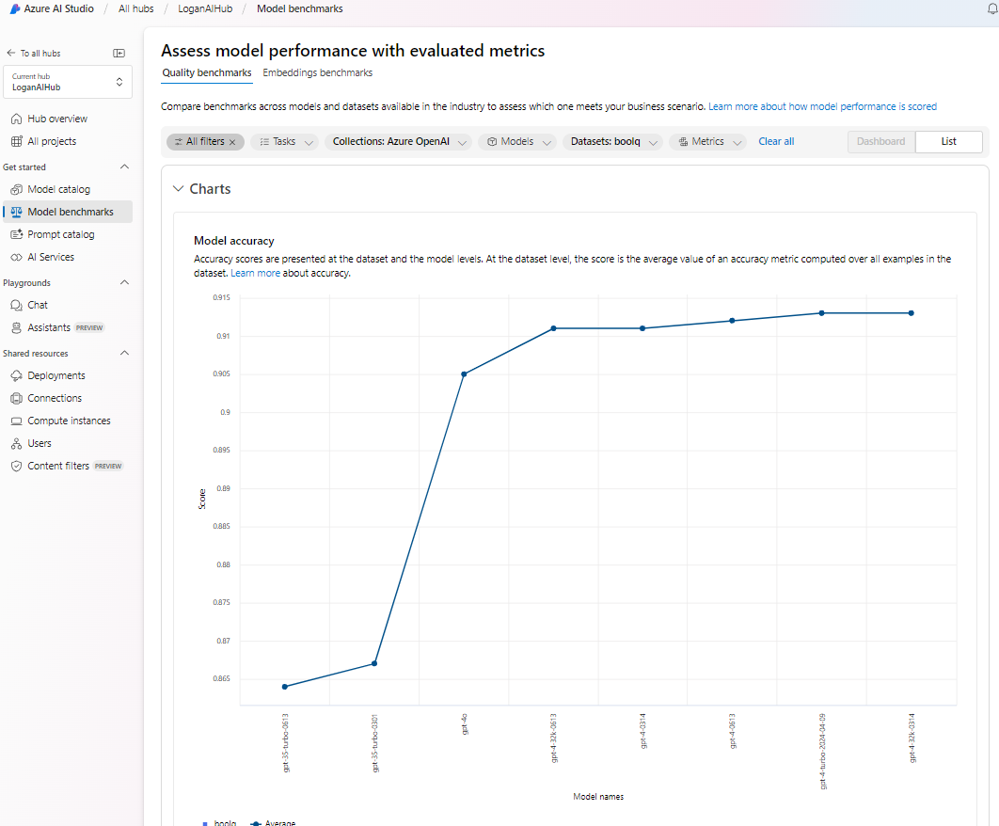
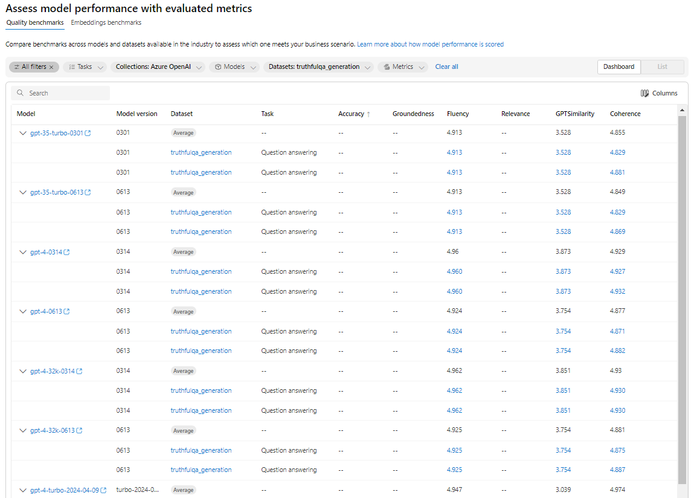

# AI Models & Services in Azure

Azure offers a variety of models & services, including but not limited to Large Language Models (LLM) and Small Language Models (SLM). Totaling over 1700 across multiple providers, deployment options and use cases. Here's a brief overview:
<!-- more -->
- Large Language Models (LLM): These are powerful AI models capable of understanding and generating human-like text. Azure's AI platform integrates with models like OpenAI's GPT (Generative Pre-trained Transformer), providing services for applications ranging from chatbots to content creation.
- Small Language Models (SLM): These models are smaller and less resource-intensive than LLMs. They are designed for more specific tasks or applications where the full power of an LLM is not required. SLMs can be more cost-effective and faster for certain applications.
- Azure Machine Learning: This is a broader platform for building, training, and deploying machine learning models at scale. It supports a wide range of model types, including but not limited to language models.
- Azure AI Studio: This is a web-based platform for building and deploying AI models. It provides a range of tools and services for developing AI solutions, including language models.

Azure's AI and machine learning capabilities are extensive, providing tools and services for a wide range of applications from simple to complex AI solutions. Today we will focus on exploring Azure AI's beating heart of AI models and services that is Azure AI Studio. 

In order to understand the capabilities of Azure AI Studio/ Azure retaining to AI models and services, we will explore the following key topics:

- Model Catalog
- Model Benchmarks
- AI Services

These topics will help us understand the range of models and services available in Azure AI Studio and how they can be used to build AI solutions. Its more important that you understand how to use AI Studio to find and explore models and services in Azure that meet your needs than to memorize to day's list of models and services which are constantly evolving.

Let's dive in!

## Model Catalog

{ align=left } The model catalog in Azure AI Studio serves as a central hub for discovering a wide range of foundation models. It features a curated collection of popular large language and vision models from renowned providers such as Microsoft, OpenAI, Hugging Face, Meta, Mistral AI, Cohere, Deci, Stability AI, Nixtla, and NVIDIA. These models are pre-packaged and optimized for seamless integration with Azure AI Studio, enabling users to leverage their power right out of the box for your application.

A lot of these foundation models offered as a model as a service (MaaS) which means you can easily deploy them in your applications without worrying about the underlying infrastructure.

Model catalog abilities for filtering and sorting models will aid you in finding the right model, For example:

- Provider: You can filter models by provider to find models from a specific collection/provider.
- Inference task: You can filter models by task to find models that are optimized for a specific task. For example, you can filter models by text generation, text classification, image classification, etc.
- Deployment options: Models can be filtered based on their deployment options, which are split into managed compute or serverless API. The serverless API is a convenient and cost-effective option with pay-as-you-go billing, eliminating the need for hosting or managing Azure infrastructure. On the other hand, the managed compute option provides users with more control by allowing them to manage hosting and perform inferencing on Azure infrastructure. Currently most of the models are available as managed compute, but more models are being added to the serverless API option.
- Fine-tuning tasks: You can filter models by fine-tuning tasks to find models that are optimized for specific fine-tuning tasks. For example, you can filter models by text generation, text classification, image classification, etc. To date around 60 models are available for fine-tuning tasks.
- License: You can filter models by license to find models that are available under a specific license. For example, you can filter models by open-source licenses, commercial licenses, etc.

Not all models are available in all Azure regions, so you will need to check the availability of the model in your region before select it. As if your application has specific requirements or constraints. For example regulatory compliance, data residency, or latency requirements which impact on the model selection. For Azure Open AI models you can find this important information via [Microsoft Learn Documentation](https://learn.microsoft.com/en-us/azure/ai-services/openai/concepts/models#model-summary-table-and-region-availability).

## Model Benchmarks

To understand the quality and performance of models, Azure AI Studio provides a benchmark dashboard that displays key metrics for each model. The benchmark dashboard and list view includes metrics, which can help you evaluate and compare models to find the best fit for your application. You can filter in a similar way to the model catalog to enable you to drill down to the models that need your needs, but the model benchmarks provides metrics to allow you to compare models based on the following metrics:

- Accuracy: Accuracy refers to the model's ability to make correct predictions. It measures how well the model's output matches the expected or ground truth values. A high accuracy indicates that the model is performing well and making accurate predictions.
- Coherence: Coherence measures the model's ability to generate text that is logically connected and flows smoothly. It assesses how well the generated text maintains a consistent and understandable context. A coherent text is easy to follow and understand.
- Fluency: Fluency evaluates the model's ability to generate text that is grammatically correct and linguistically natural. It focuses on the smoothness and naturalness of the generated text. A fluent text reads naturally and does not contain grammatical errors or awkward phrasing.
- Groundedness: Groundedness refers to the model's ability to generate text that is based on factual information or evidence. It measures how well the generated text is supported by relevant and accurate information. A grounded text is reliable and based on solid evidence.
- Relevance: Relevance assesses the model's ability to generate text that is pertinent and applicable to the given context or topic. It measures how well the generated text addresses the specific requirements or questions. A relevant text provides meaningful and useful information related to the given topic.
- GPTSimilarity: GPTSimilarity measures the model's ability to generate text that is similar to the output of GPT (Generative Pre-trained Transformer). It evaluates how closely the generated text matches the style, structure, and content of GPT-generated text. A high GPTSimilarity indicates that the model is capable of producing text that is similar to GPT-generated text.

All of these metrics are calculated as a percentage based on an average from a selection of datasets (boolq, gsm8k, hellaswag, etc). The benchmark dashboard provides a visual representation of these metrics, allowing you to compare models at a glance. You can also view the detailed results for each metric by clicking on the model name in the list view.

Azure AI Studio Benchmark dashboard example:

The list view provides the same information as the benchmark dashboard but in a tabular format give you the ability consume in another way and search the results.

Azure AI Studio Benchmark list example:

It is important to understand there is a separate benchmarks for embedding models under the tab "Embedding Benchmarks". These use different metrics and datasets to evaluate the quality and performance of embedding models.

## AI Services

Azure AI Studio provides a range of AI services that can be used to build and deploy AI solutions. These services include but are not limited to:

## Speech Services

## Vision & Document Services

## Content Safety Services

Idea to spilt this into separate videos for each service, to provide a more in-depth look at each service and how it can be used to build AI solutions.

## References

- [Azure AI Model Catalog](https://azure.microsoft.com/en-us/products/ai-model-catalog/)
