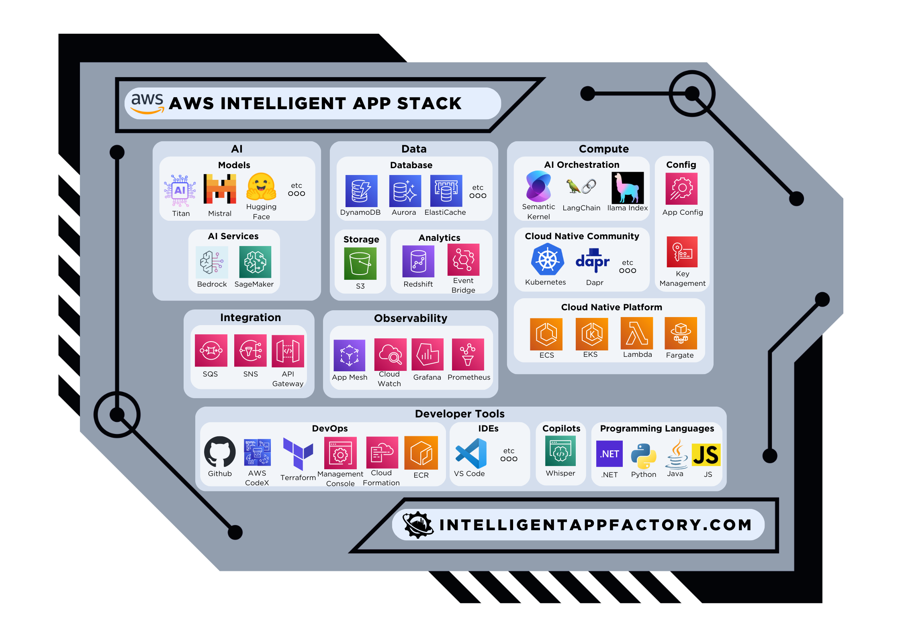

# AWS Intelligent App Stack

Amazon Web Services (AWS) is a subsidiary of Amazon providing on-demand cloud computing platforms and APIs to individuals, companies, and governments, on a metered pay-as-you-go basis. AWS offers a wide range of services including computing, storage, databases, analytics, networking, AI, and IoT. AWS provides create options for building, deploying, and managing intelligent applications through its global network of data centers.

Here is the AWS Intelligent Application Stack:

## AI
| Category | Service | Description | Documentation |
| --- | --- | --- | --- |
| Models | Mistral AI | LLMs created by Mistral AI for advanced AI modeling | [Link](https://docs.mistral.ai/cloud-deployment/azure/) |
| Models | Meta | AI models developed by Meta e.g. Llama 2 | [Link](https://llama.meta.com/get-started/) |
| Models | Amazon Titan | High-performing foundation models from Amazon | [Link](https://aws.amazon.com/bedrock/titan/) |
| Models | Hugging Face | Open source AI Models | [Link](https://huggingface.co/) |
| Models | Deci AI | Simplify and accelerate the development of computer vision, Generative AI, and NLP applications with advanced tools to build, optimize, and deploy accurate and highly efficient models. | [Link](https://deci.ai/) |

## Data
| Category | Services | Description | Documentation |
| --- | --- | --- | --- |
| Managed Databases | DynamoDB | Fully managed NoSQL database service | [Link](https://docs.aws.amazon.com/amazondynamodb/latest/developerguide/Introduction.html) |
| Managed Databases | Aurora | Fully managed MySQL and PostgreSQL-compatible relational database | [Link](https://docs.aws.amazon.com/AmazonRDS/latest/AuroraUserGuide/CHAP_GettingStarted.html) |
| Managed Databases | ElastiCache | Fully managed in-memory data store and cache service | [Link](https://docs.aws.amazon.com/AmazonElastiCache/latest/mem-ug/WhatIs.html) |
| Storage | Simple Storage Service (S3) | Scalable object storage service | [Link](https://docs.aws.amazon.com/AmazonS3/latest/userguide/Welcome.html) |
| Analytics | Amazon Redshift | Fully managed, petabyte-scale data warehouse service | [Link](https://docs.aws.amazon.com/redshift/latest/mgmt/welcome.html) |
| Analytics | Event Bridge | Serverless event bus service | [Link](https://docs.aws.amazon.com/eventbridge/latest/userguide/what-is-amazon-eventbridge.html) |

## Compute
| Category | Service | Description | Documentation |
| --- | --- | --- | --- |
| AI Orchestration | Semantic Kernel | AI orchestration SDK for .NET, Java, & Python | [Link](https://learn.microsoft.com/en-us/semantic-kernel/overview/) |
| AI Orchestration | LangChain | AI orchestration SDK for Python, & JavaScript | [Link](https://python.langchain.com/docs/get_started/introduction) |
| AI Orchestration | Llama Index | LlamaIndex, Data Framework for LLM Applications | [Link](https://www.llamaindex.ai/) |
| Cloud Native Platform | Amazon Elastic Container Service (ECS) | Fully managed container orchestration service | [Link](https://docs.aws.amazon.com/AmazonECS/latest/developerguide/Welcome.html) |
| Cloud Native Platform | Amazon Elastic Kubernetes Service (EKS) | Managed Kubernetes service | [Link](https://docs.aws.amazon.com/eks/latest/userguide/what-is-eks.html) |
| Cloud Native Platform | Lambda | Serverless compute service | [Link](https://docs.aws.amazon.com/lambda/latest/dg/welcome.html) |
| Cloud Native Platform | AWS Fargate | Serverless compute engine for containers | [Link](https://docs.aws.amazon.com/AmazonECS/latest/developerguide/AWS_Fargate.html) |
| Cloud Native Community | Kubernetes | Open-source system for automating deployment, scaling, and management of containerized applications | [Link](https://kubernetes.io/docs/home/) |
| Cloud Native Community | Dapr | Event-driven, portable runtime for building microservices | [Link](https://dapr.io/) |
| Cloud Native Community | Helm | The package manager for Kubernetes | [Link](https://helm.sh/) |
| Cloud Native Community | KEDA | Kubernetes-based event-driven autoscaling component | [Link](https://keda.sh/) |
| Secrets & Config | App Config | Service that centralizes app configuration and feature settings | [Link](https://docs.aws.amazon.com/appconfig/latest/userguide/what-is-appconfig.html) |
| Secrets & Config | Key Management Service | Service for securely storing and accessing secrets | [Link](https://docs.aws.amazon.com/kms/latest/developerguide/overview.html) |

## Integration
| Category | Service | Description | Documentation |
| --- | --- | --- | --- |
| Integration | Amazon Simple Queue Service (SQS) | Fully managed message queuing service | [Link](https://docs.aws.amazon.com/AWSSimpleQueueService/latest/SQSDeveloperGuide/welcome.html) |
| Integration | Amazon Simple Notification Service (SNS) | Fully managed pub/sub messaging service | [Link](https://docs.aws.amazon.com/sns/latest/dg/welcome.html) |
| Integration | Amazon API Gateway | Fully managed API gateway service | [Link](https://docs.aws.amazon.com/apigateway/latest/developerguide/welcome.html) |

## Observability
| Category | Service | Description | Documentation |
| --- | --- | --- | --- |
| Observability | Azure Monitor | Full stack monitoring service for applications and infrastructure | [Link](https://docs.microsoft.com/en-us/azure/azure-monitor/) |
| Observability | Azure Application Insights | Application performance management service for developers and DevOps professionals | [Link](https://learn.microsoft.com/en-us/azure/azure-monitor/) |
| Observability | Azure Managed Grafana | Fully managed Grafana service for visualizing real-time analytics | [Link](https://learn.microsoft.com/en-us/azure/managed-grafana/) |
| Observability | Azure Managed Prometheus | Fully managed Prometheus service for monitoring system metrics | [Link](https://learn.microsoft.com/en-us/azure/azure-monitor/essentials/prometheus-metrics-overview) |

## Development Tools
| Category | Service | Description | Documentation |
| --- | --- | --- | --- |
| DevOps Tools | GitHub | Platform for version control and collaboration | [Link](https://docs.github.com/) |
| DevOps Tools | AWS CodeArtifact | Fully managed software artifact repository service | [Link](https://docs.aws.amazon.com/codeartifact/latest/ug/welcome.html) |
| DevOps Tools | AWS CodeBuild | Fully managed build service | [Link](https://docs.aws.amazon.com/codebuild/latest/userguide/welcome.html) |
| DevOps Tools | AWS CodeCommit | Fully managed source control service | [Link](https://docs.aws.amazon.com/codecommit/latest/userguide/welcome.html) |
| DevOps Tools | AWS CodeDeploy | Automated deployment service | [Link](https://docs.aws.amazon.com/codedeploy/latest/userguide/welcome.html) |
| DevOps Tools | AWS CodePipeline | Fully managed continuous integration and continuous delivery service | [Link](https://docs.aws.amazon.com/codepipeline/latest/userguide/welcome.html) |
| DevOps Tools | AWS CloudFormation | Infrastructure as Code tool for building, changing, and versioning infrastructure | [Link](https://docs.aws.amazon.com/AWSCloudFormation/latest/UserGuide/Welcome.html) |
| DevOps Tools | Terraform | Infrastructure as Code tool for building, changing, and versioning infrastructure | [Link](https://www.terraform.io/docs/index.html) |
| DevOps Tools | Powershell | Task automation and configuration management framework | [Link](https://docs.microsoft.com/en-us/powershell/) |
| DevOps Tools | Management Console | Web-based user interface for accessing and managing AWS services | [Link](https://docs.aws.amazon.com/console/index.html) |
| DevOps Tools | Amazon Elastic Container Registry (ECR) | Fully managed container registry service | [Link](https://docs.aws.amazon.com/AmazonECR/latest/userguide/what-is-ecr.html) |
| IDEs | Visual Studio Code | Free source-code editor made by Microsoft | [Link](https://code.visualstudio.com/docs) |
| Copilots | Amazon CodeWhisperer | AI-powered code completion tool | [Link](https://aws.amazon.com/blogs/aws/amazon-codewhisperer-free-for-individual-use-is-now-generally-available/) |
| Programming Languages | .NET | Programming language that supports development of IA| [Link](https://docs.microsoft.com/en-us/dotnet/) |
| Programming Languages | Java | Programming language that supports development of IA | [Link](https://docs.oracle.com/en/java/) |
| Programming Languages | Python | Programming language that supports development of IA | [Link](https://docs.python.org/3/) |
| Programming Languages | JS/NodeJS | Programming language that supports development of IA | [Link](https://nodejs.org/docs/latest/api/) |