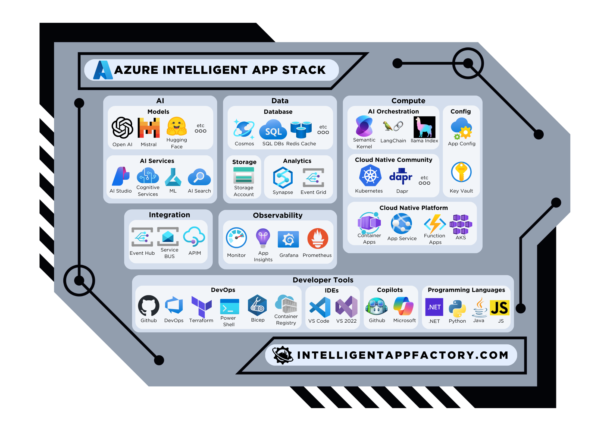

# Overview

Azure is a cloud computing platform and infrastructure created by Microsoft. The platform offers a wide range of services including computing, storage, databases, analytics, networking, AI, and IoT. Azure provides create options for building, deploying, and managing intelligent applications through its global network of data centers.

Here is the Azure Intelligent Application Stack:

## AI
| Category | Service | Description | Documentation |
| --- | --- | --- | --- |
| Models | Mistral AI | LLMs created by Mistral AI for advanced AI modeling | [Link](https://docs.mistral.ai/cloud-deployment/azure/) |
| Models | Meta | AI models developed by Meta e.g. Llama 2 | [Link](https://llama.meta.com/get-started/) |
| Models | Azure Open AI | Open source AI models provided by Azure e.g. GPT4 | [Link](https://learn.microsoft.com/en-us/azure/ai-services/openai/) |
| Models | Hugging Face | Open source AI Models | [Link](https://huggingface.co/) |
| Models | Deci AI | Simplify and accelerate the development of computer vision, Generative AI, and NLP applications with advanced tools to build, optimize, and deploy accurate and highly efficient models. | [Link](https://deci.ai/blog/deci-generative-ai-models-join-azure-ai-studio/) |
| Models | NVIDIA | NVIDIA AI Foundation Models | [Link](https://nvidianews.nvidia.com/news/nvidia-introduces-generative-ai-foundry-service-on-microsoft-azure-for-enterprises-and-startups-worldwide) |
| Models | Microsoft Research | Cutting-edge AI models from Microsoft Research | [Link](https://techcommunity.microsoft.com/t5/ai-machine-learning-blog/welcoming-mistral-phi-jais-code-llama-nvidia-nemotron-and-more/ba-p/3982699) |
| AI Services | Azure Cognitive Services | Suite of AI services and cognitive APIs to help developers build intelligent applications | [Link](https://learn.microsoft.com/en-us/azure/ai-services/) |
| AI Services | Azure Machine Learning | Service that provides a cloud-based environment you can use to develop, train, test, deploy, manage, and track machine learning models | [Link](https://learn.microsoft.com/en-us/azure/machine-learning) |
| AI Services | Azure AI Studio | Build cutting-edge, market-ready, responsible applications for your organization with AI | [Link](https://learn.microsoft.com/en-us/azure/ai-studio/) |
| AI Services | Azure AI Search | AI-powered cloud search service for mobile and web app development | [Link](https://docs.microsoft.com/en-us/azure/search/) |

## Data
| Category | Services | Description | Documentation |
| --- | --- | --- | --- |
| Managed Databases | Azure Cosmos DB | Globally distributed, multi-model database service | [Link](./azure/azure-cosmos-db.md) |
| Managed Databases | Azure SQL Family | Fully managed relational database with auto-scale, integral intelligence, and robust security | [Link](https://docs.microsoft.com/en-us/azure/sql-database/) |
| Managed Databases | Postgres | Fully managed, intelligent, and flexible PostgreSQL relational database service | [Link](https://docs.microsoft.com/en-us/azure/postgresql/) |
| Managed Databases | Azure Cache for Redis | Fully managed, open source-compatible in-memory data store to power fast, scalable applications | [Link](https://docs.microsoft.com/en-us/azure/azure-cache-for-redis/) |
| Storage | Azure Storage Account | Durable, highly available, and massively scalable cloud storage | [Link](https://learn.microsoft.com/en-us/azure/storage/) |
| Analytics | Azure Synapse Analytics | Analytics service that brings together enterprise data warehousing and Big Data analytics | [Link](https://docs.microsoft.com/en-us/azure/synapse-analytics/) |
| Analytics | Azure Event Hubs | Big data streaming platform and event ingestion service | [Link](https://docs.microsoft.com/en-us/azure/event-hubs/) |

## Compute
| Category | Service | Description | Documentation |
| --- | --- | --- | --- |
| AI Orchestration | Semantic Kernel | AI orchestration SDK for .NET, Java, & Python | [Link](https://learn.microsoft.com/en-us/semantic-kernel/overview/) |
| AI Orchestration | LangChain | AI orchestration SDK for Python, & JavaScript | [Link](https://python.langchain.com/docs/get_started/introduction) |
| AI Orchestration | Llama Index | LlamaIndex, Data Framework for LLM Applications | [Link](https://www.llamaindex.ai/) |
| Cloud Native Platform | Azure Container Apps | Fully managed service for running containerized apps | [Link](https://docs.microsoft.com/en-us/azure/container-apps/) |
| Cloud Native Platform | Azure App Service | Fully managed platform for building, deploying, and scaling web apps | [Link](https://docs.microsoft.com/en-us/azure/app-service/) |
| Cloud Native Platform | Azure Functions | Event-driven, serverless compute platform | [Link](https://docs.microsoft.com/en-us/azure/azure-functions/) |
| Cloud Native Platform | Azure Kubernetes | Managed Kubernetes service for deploying, managing, and scaling containerized applications | [Link](https://docs.microsoft.com/en-us/azure/aks/) |
| Cloud Native Community | Kubernetes | Open-source system for automating deployment, scaling, and management of containerized applications | [Link](https://kubernetes.io/docs/home/) |
| Cloud Native Community | Dapr | Event-driven, portable runtime for building microservices | [Link](https://dapr.io/) |
| Cloud Native Community | Helm | The package manager for Kubernetes | [Link](https://helm.sh/) |
| Cloud Native Community | KEDA | Kubernetes-based event-driven autoscaling component | [Link](https://keda.sh/) |
| Secrets & Config | Azure App Configuration | Service that centralizes app configuration and feature settings | [Link](https://docs.microsoft.com/en-us/azure/azure-app-configuration/) |
| Secrets & Config | Azure Key Vault | Service for securely storing and accessing secrets | [Link](https://docs.microsoft.com/en-us/azure/key-vault/) |

## Integration
| Category | Service | Description | Documentation |
| --- | --- | --- | --- |
| Integration | Azure Service Bus | Fully managed enterprise message broker with message queues and publish-subscribe topics | [Link](https://docs.microsoft.com/en-us/azure/service-bus-messaging/) |
| Integration | Azure Event Grid | Fully managed event routing service | [Link](https://docs.microsoft.com/en-us/azure/event-grid/) |
| Integration | Azure API Management | Turnkey solution for publishing APIs to external and internal customers | [Link](https://docs.microsoft.com/en-us/azure/api-management/) |

## Observability
| Category | Service | Description | Documentation |
| --- | --- | --- | --- |
| Observability | Azure Monitor | Full stack monitoring service for applications and infrastructure | [Link](https://docs.microsoft.com/en-us/azure/azure-monitor/) |
| Observability | Azure Application Insights | Application performance management service for developers and DevOps professionals | [Link](https://learn.microsoft.com/en-us/azure/azure-monitor/) |
| Observability | Azure Managed Grafana | Fully managed Grafana service for visualizing real-time analytics | [Link](https://learn.microsoft.com/en-us/azure/managed-grafana/) |
| Observability | Azure Managed Prometheus | Fully managed Prometheus service for monitoring system metrics | [Link](https://learn.microsoft.com/en-us/azure/azure-monitor/essentials/prometheus-metrics-overview) |

## Development Tools
| Category | Service | Description | Documentation |
| --- | --- | --- | --- |
| DevOps Tools | GitHub | Platform for version control and collaboration | [Link](https://docs.github.com/) |
| DevOps Tools | Azure DevOps | Services for teams to share code, track work, and ship software | [Link](https://docs.microsoft.com/en-us/azure/devops/user-guide/) |
| DevOps Tools | Terraform | Infrastructure as Code tool for building, changing, and versioning infrastructure | [Link](https://www.terraform.io/docs/index.html) |
| DevOps Tools | Powershell | Task automation and configuration management framework | [Link](https://docs.microsoft.com/en-us/powershell/) |
| DevOps Tools | Bicep | Infrastructure as Code tool for deploying infrastructure Azure resources | [Link](https://docs.microsoft.com/en-us/azure/azure-resource-manager/bicep/overview) |
| DevOps Tools | Azure Container Registry | Managed Docker registry service for storing and managing container images | [Link](https://docs.microsoft.com/en-us/azure/container-registry/) |
| IDEs | Visual Studio Code | Free source-code editor made by Microsoft | [Link](https://code.visualstudio.com/docs) |
| IDEs | Visual Studio 2022 | Integrated development environment from Microsoft | [Link](https://docs.microsoft.com/en-us/visualstudio/) |
| Copilots | GitHub Copilot | AI-powered code completion tool | [Link](https://copilot.github.com/) |
| Copilots | Microsoft Copilot for Azure | AI-powered tool for Azure services | [Link](https://azure.microsoft.com/en-us/products/copilot#Overview) |
| Programming Languages | .NET | Programming language that supports development of IA| [Link](https://docs.microsoft.com/en-us/dotnet/) |
| Programming Languages | Java | Programming language that supports development of IA | [Link](https://docs.oracle.com/en/java/) |
| Programming Languages | Python | Programming language that supports development of IA | [Link](https://docs.python.org/3/) |
| Programming Languages | JS/NodeJS | Programming language that supports development of IA | [Link](https://nodejs.org/docs/latest/api/) |