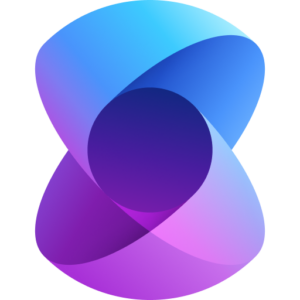

# Semantic Kernel for .NET Intelligent Apps

{ align=left width=150 }

Semantic Kernel is an open-source Software Development Kit (SDK) that lets you easily build agents that can call your existing code. As a highly extensible SDK, you can use Semantic Kernel with models from OpenAI, Azure OpenAI, Hugging Face, and more! By combining your existing C#, Python, and Java code with these models, you can build agents that answer questions and automate processes.

## Key Links

- [Semantic Kernel Documentation](https://docs.microsoft.com/en-us/semantic-kernel/): Learn how to use the Microsoft Semantic Kernel to build intelligent applications on the .NET platform.
- [Semantic Kernel GitHub Repository](https://github.com/microsoft/semantic-kernel): Contribute to the Microsoft Semantic Kernel on GitHub.
- [Semantic Kernel Office Hour](https://devblogs.microsoft.com/semantic-kernel/semantic-kernel-office-hours-recordings/) - [Recordings](https://devblogs.microsoft.com/semantic-kernel/semantic-kernel-office-hours-recordings/): Watch the recordings of the Microsoft Semantic Kernel Office Hour sessions.
- [Semantic Kernel Blog](https://devblogs.microsoft.com/semantic-kernel/) - [Blog](https://devblogs.microsoft.com/semantic-kernel/): Read the latest blog posts about the Microsoft Semantic Kernel.
- [.NET AI Community Standup](https://www.youtube.com/playlist?list=PLReL099Y5nRd04p81Qv0k7n5Y6J1vFv1n): Watch the .NET AI Community Standup to learn more about the Semantic Kernel and other AI tools for .NET developers.

## Getting Started

Learn more about the Semantic Kernel and how to use it in your .NET intelligent applications:

- Microsoft Learn path, [APL-2005 Develop AI agents using Azure OpenAI and the Semantic Kernel SDK](https://learn.microsoft.com/en-us/training/paths/develop-ai-agents-azure-open-ai-semantic-kernel-sdk/): Focused on how to use the Semantic Kernel SDK to build intelligent applications that automate tasks and perform natural language processing ([more information](https://devblogs.microsoft.com/semantic-kernel/learning-paths-for-semantic-kernel/)).

## Projects and samples built with Semantic Kernel

- [Project Miyagi](https://github.com/Azure-Samples/miyagi): Reimagines the design, development, and deployment of intelligent applications on top of Azure with all of the latest AI services and tools.

